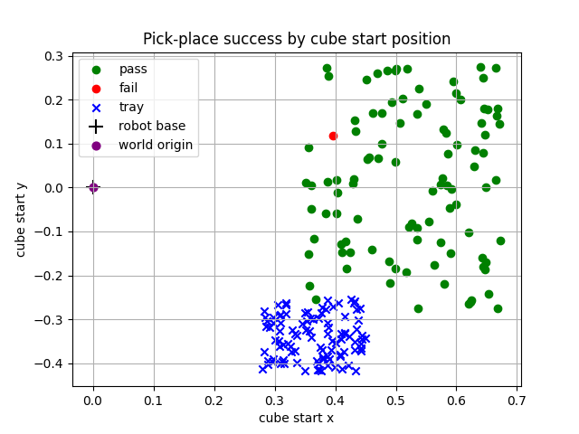
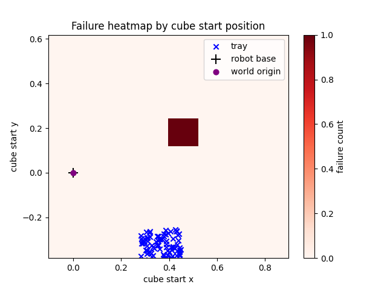

# VLA-Lite: Vision-Language Robot Manipulation in PyBullet

**VLA-Lite** is a complete simulated Vision-Language-Action project: a **Franka Panda** robot receives a natural-language command, identifies the requested cube through **wrist-camera RGB-D perception**, reconstructs the cube's **3D world position**, picks it, and places it into a blue tray.

```text
pick green cube and place in blue tray
```

The project is intentionally small enough to understand end to end, but it includes the important robotics pieces: command parsing, HSV color perception, depth projection, multi-view 3D reconstruction, inverse kinematics, gripper execution, randomized testing, and metric artifacts.

## Visual Demo

| Simulation View | Wrist-Camera Detection | Placement |
| --- | --- | --- |
|  |  |  |

[Watch the 30-second demo video](demo.mp4)

## Tech Stack

| Layer | Tech |
| --- | --- |
| Language | **Ollama**, JSON-only task parsing, schema validation |
| Vision | **OpenCV**, HSV thresholding, contour scoring |
| Depth | **PyBullet RGB-D camera**, depth buffer unprojection |
| 3D reconstruction | **NumPy**, point-cloud trimming, multi-view bounds |
| Simulation | **PyBullet**, Franka Panda URDF, DIRECT and GUI modes |
| Control | **PyBullet inverse kinematics**, joint position control |
| Metrics | **Matplotlib**, CSV logs, Markdown reports |

## Headline Result

The latest multi-view benchmark gets **99.00% pick-and-place success**:

```text
Run folder: outputs/testing/run_20260602_201217_multiview
Mode: multiview
Runs: 100
Successes: 99
Success rate: 99.00%
Initial cube/tray overlaps: 0
Non-overlap failures: 1
```

Older direct-control benchmark:

```text
Run folder: outputs/testing/run_20260527_235245
Mode: direct
Runs: 1000
Successes: 702
Success rate: 70.20%
Initial cube/tray overlaps: 0
Non-overlap failures: 298
```

The difference is the perception loop. The old version trusted one target estimate. The newer version uses a rough detection, moves the wrist camera through multiple inspection poses, merges depth points from those views, and estimates the cube center from the reconstructed 3D point cloud.

## What The Robot Actually Does


The command layer does not send free-form text straight to the robot. Ollama produces a small JSON task, `command_schema.py` validates it, and the executor only runs supported actions: `pick`, `place`, or `pick_place`.

## Color Detection

The color system is not based on "avoid similar distractors." It uses explicit **OpenCV HSV ranges**.

RGB images from the PyBullet wrist camera are converted to HSV:

```text
RGB image -> HSV image -> threshold ranges -> binary mask -> contours -> cube candidate
```

The built-in color ranges live in `src/perception/color_detector.py` and `src/language/command_schema.py`. Example presets:

| Color | HSV range |
| --- | --- |
| Green | `[45,100,100]..[80,255,255]` |
| Blue | `[100,120,80]..[130,255,255]` |

Ollama can also infer HSV ranges from a typed command. Before robot execution, `command_schema.py` validates every triplet:

```text
0 <= H <= 180
0 <= S <= 255
0 <= V <= 255
```

Then OpenCV finds contours from the mask. The detector scores each candidate with:

```text
confidence =
  0.30 * color_fill
+ 0.25 * square_score
+ 0.20 * saturation_score
+ 0.15 * value_score
+ 0.10 * size_score
```

That is why the detector can reject weak blobs and tray-sized regions. A good cube is saturated, bright, compact, square-ish, and mostly filled by the requested color.

## Wrist Camera Math

The camera is mounted relative to the Panda end effector. Every RGB-D frame is captured from a synthetic wrist pose:

```text
eye    = end_effector_position + [0.12, 0.00,  0.12]
target = end_effector_position + [0.18, 0.00, -0.28]
up     = [0, 0, 1]
```

PyBullet uses those vectors to build a view matrix, and a 60 degree FOV projection matrix:

```text
view       = computeViewMatrix(eye, target, up)
projection = computeProjectionMatrixFOV(fov=60, aspect=1280/720, near=0.01, far=2.0)
```

Each OpenCV detection gives a pixel center `(x, y)` and a binary mask. For every valid mask pixel, the depth buffer value is converted into [normalized device coordinates](docs/ndc.md):

```text
ndc_x = 2*x/width - 1
ndc_y = 1 - 2*y/height
ndc_z = 2*z_buffer - 1

clip = [ndc_x, ndc_y, ndc_z, 1]
```

Then the project reverses the camera transform:

```text
world_h = inverse(projection * view) * clip
world   = world_h.xyz / world_h.w
```

That is the bridge from a 2D OpenCV mask to a real PyBullet world coordinate the robot can move toward.

## From Median Point To 3D Reconstruction

The first localization method projected mask pixels into world space, removed outliers, and took the median:

```text
visible_center = median(projected_mask_points)
```

That is simple and stable, but a wrist camera usually sees the near face of the cube, not the true cube center. So the project nudges the estimate inward along the camera ray:

```text
view_xy = visible_center.xy - camera_position.xy
inset   = clamp(norm(point_spread_xy) * 0.35, 0.012, 0.035)
center.xy = visible_center.xy + normalize(view_xy) * inset
```

That helped, but it still depended on one view. The final multi-view idea is stronger: move the wrist camera around the rough estimate, collect visible depth points from multiple angles, and reconstruct the cube from the combined point cloud.

## Multi-View Localization

The multi-view scan uses four inspection poses around the rough cube estimate:

| View | Offset from rough cube position |
| --- | --- |
| Center | `(0.00, 0.00, 0.30)` |
| Left | `(0.00, 0.12, 0.30)` |
| Right | `(0.00, -0.12, 0.30)` |
| Front | `(-0.12, 0.00, 0.30)` |

For each view:

```text
move wrist camera -> capture RGB-D -> HSV mask -> project mask pixels -> world points
```

Then all valid points are merged:

```text
P = points_center union points_left union points_right union points_front
P_clean = trim_outliers(P, 10th..90th percentile)
```

The cube center is estimated from the cleaned point-cloud bounds:

```text
lower  = min(P_clean, axis=0)
upper  = max(P_clean, axis=0)
center = (lower + upper) / 2
center_z = upper_z - cube_half_size
```

The `z` correction matters because the camera usually sees the top and side faces, not the bottom face sitting on the table.

## Multi-View Proof

This GUI debug run saved RGB, mask, depth, and world-coordinate debug images for every view:

```text
outputs/multiview_gui/run_20260602_195006
```

Each view writes the full perception trace:

```text
RGB frame -> HSV mask -> depth image -> bbox/world overlay
```

| Center | Left | Right | Front |
| --- | --- | --- | --- |
|  |  |  |  |

The same run produced this calculation:

```text
Actual PyBullet cube center:    (0.48000, 0.00000, 0.02999)
Merged point count:             3344
Trimmed merged min xyz:         (0.45655, -0.02554, 0.06003)
Trimmed merged max xyz:         (0.50998,  0.02573, 0.06004)
Estimated center:               (0.48327,  0.00009, 0.03004)
Error estimated - actual:       (0.00327,  0.00009, 0.00005)
```

That is the core reason multi-view helped: one view can mistake a visible face for the object center; multiple views recover the cube's x/y extent and let the code estimate the actual geometric center.

The debug script also writes `view_calculations.csv`, so the per-view bbox, confidence, point count, and 3D min/max bounds can be inspected instead of trusting only the final image.

## Benchmark Evidence

Latest benchmark command:

```powershell
python testing\test_pick_place_100.py --MV
```

The test runs in PyBullet DIRECT mode, resets the scene every trial, samples new cube/tray positions, runs the vision-guided pick-and-place sequence, and writes:

```text
report.md
pick_place_results.csv
start_positions.png
failure_heatmap.png
```

| Start Positions | Failure Heatmap |
| --- | --- |
|  |  |

The new plot is mostly green because the multi-view estimate gives the gripper a much better target. The single remaining failure is isolated instead of forming the large failure region seen in the older direct benchmark.

## Calibration Tests

Two smaller test scripts were used to make the final benchmark meaningful.

`testing/test_detection_offset.py` checks the perception side. It places known colored cubes at fixed world positions, runs the same RGB-D + HSV + depth-cluster path used by picking, and compares the detected world point against PyBullet ground truth.

```text
actual cube center -> detected world point -> xyz error
```

It writes a CSV, Markdown report, offset plot, and per-case debug images under `outputs/detection_offset/`.

`testing/test_tcp_offset.py` checks the robot side. It measures the difference between the requested target, Panda link 11, and the actual midpoint between the two gripper fingers. That test is why the motion layer targets the **pinch center** instead of blindly trusting the end-effector link.

```text
requested target -> link-11 position
requested target -> finger midpoint
```

It writes `tcp_offsets.csv`, a Markdown report, and a top-down offset plot under `outputs/tcp_offset/`.

## Robot Execution

After localization, the robot runs a simple, inspectable manipulation sequence:

```text
move above cube
move to pre-grasp
move to grasp height
close gripper
lift
move above tray
lower to tray drop height
open gripper
return home after command-driven place
```

The implementation uses two important details:

- `move_pinch_center_to_position()` targets the midpoint between the Panda fingers, not just the end-effector link.
- `ik_solver.py` wraps PyBullet IK so the motion layer can work in world coordinates.
- `failsafe.py` watches PyBullet contacts during the GUI loop and freezes the arm if unsafe non-gripper collisions happen with the cube, tray, or table.

## Core Controls

Full controls are in [`docs/hotkeys.md`](docs/hotkeys.md). The only controls most users need are:

| Key | Action |
| --- | --- |
| `l` | Type a natural-language command, parse it with Ollama, and execute it |
| `j` | Run the vision-guided red-cube pick-and-place demo |
| `r` | Randomize the scene and reset the robot |

## Quick Start

```powershell
python -m venv .venv
.\.venv\Scripts\Activate.ps1
pip install -r requirements.txt
python -m src.sim.panda_env
```

Run the latest benchmark:

```powershell
python testing\test_pick_place_100.py --MV
```

Generate a visible multi-view debug run:

```powershell
python testing\test_multiview_gui.py
```

## Repository Map

```text
VLA/
├── docs/                # demo screenshots, hotkeys, and source citations
├── outputs/             # detection images, multiview debug runs, benchmarks
├── src/language/        # Ollama parser and command schema
├── src/perception/      # camera, HSV detection, depth projection, multiview
├── src/sim/             # PyBullet scene, robot control, IK, routines
├── testing/             # benchmark and GUI debug scripts
├── config/              # local robot speed tuning
└── requirements.txt
```

## Why This Project Is Interesting

VLA-Lite is not a black-box policy demo. It shows the whole stack:

- A prompt becomes a validated robot task.
- A color word becomes HSV ranges.
- HSV ranges become a binary OpenCV mask.
- Mask pixels become 3D PyBullet world points.
- Single-view median localization becomes multi-view point-cloud reconstruction.
- A reconstructed cube center becomes IK target poses.
- Randomized benchmarks produce real success-rate evidence.

That makes the project useful as a compact robotics learning system and as a clean demonstration of how vision, language, geometry, and action connect.

## Sources

External references, citation notes, and local benchmark artifacts used as evidence are tracked in [`docs/sources.md`](docs/sources.md).
