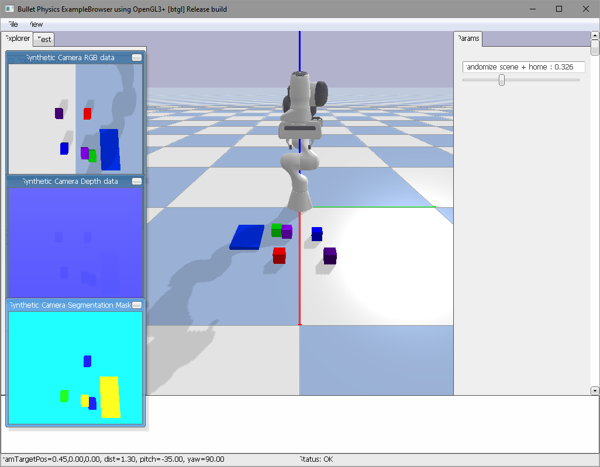
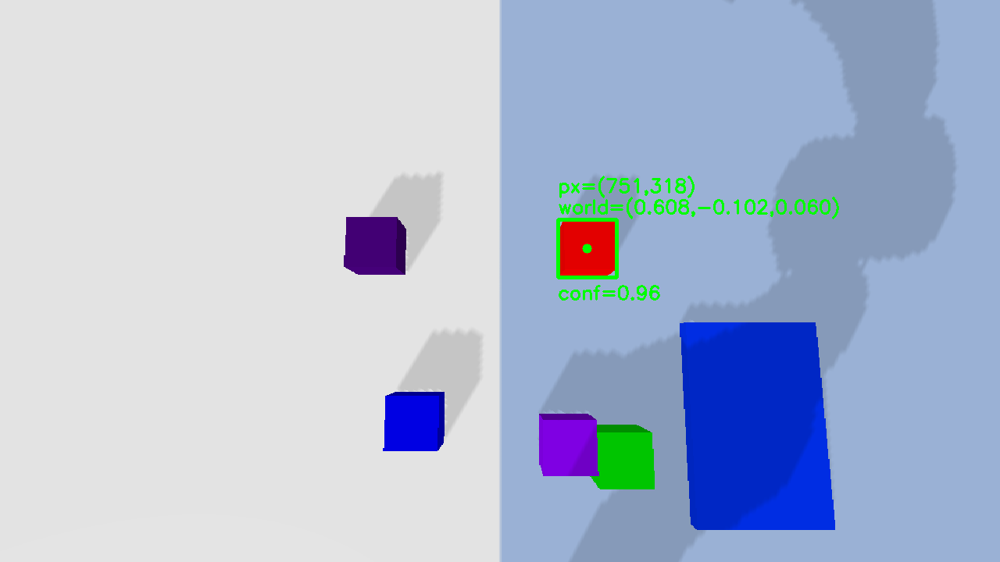
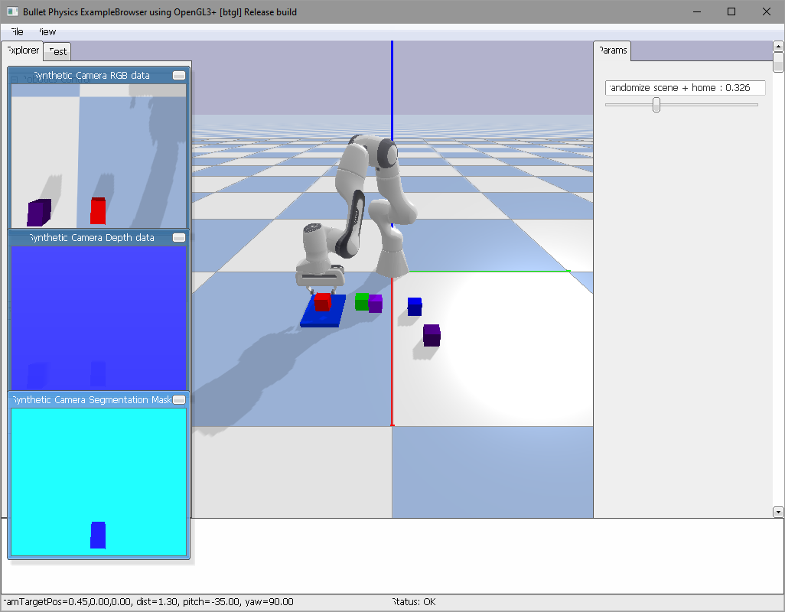
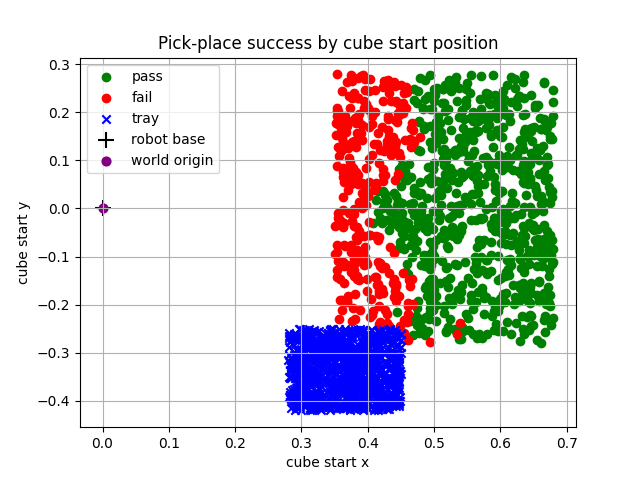
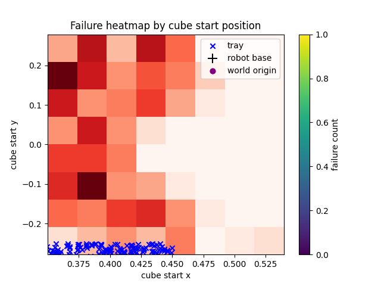
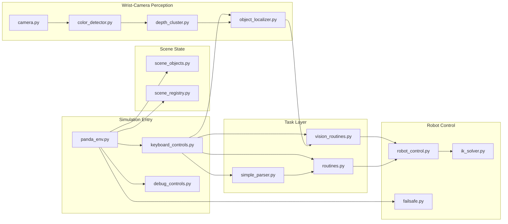

# VLA-Lite: Vision-Language-Guided Robot Manipulation in Simulation

VLA-Lite is a Python-first robotics simulation project where a Franka Panda arm uses a wrist camera, OpenCV perception, depth-based localization, and IK control to pick a red cube and place it into a blue tray.

The guiding command is:

```text
pick red cube and place in blue tray
```

The project is built as an end-to-end learning system: every major robotics step is visible in code, from scene setup to perception output to robot motion.

## Demo Snapshots

| Home | Wrist-camera detection | Place attempt |
| --- | --- | --- |
|  |  |  |

## Objective

The project connects four parts of the manipulation stack:

1. language intent: understand the target object and destination,
2. vision: detect the red cube from the robot's camera,
3. geometry: convert image/depth data into a 3D target,
4. control: move the Panda gripper through a pick-and-place sequence.

The task is narrow by design: it gives a clear pass/fail loop while the implementation remains easy to inspect.

## Highlights

- End-to-end wrist-camera perception pipeline using OpenCV and depth projection
- Practical PyBullet-based robot control with an `ik_solver` wrapper and waypoint motion
- Reproducible reliability testing harness with CSV logs and failure heatmaps
- Config-driven speed and physics tuning for easier local experimentation
- Small rule-based language parser that maps short commands to object actions

## Implemented features (concrete)

- Wrist-camera RGB-D capture and debug output: `src/perception/camera.py` and `src/perception/color_detector.py`
- Depth projection and clustering for world-point estimation: `src/perception/depth_cluster.py` and `src/perception/object_localizer.py`
- Vision-driven routines and robot interface: `src/perception/vision_routines.py`, `src/sim/robot_control.py`, and `src/sim/ik_solver.py`
- Simulation entry, interactive controls, and panel toggles: `src/sim/panda_env.py`, `src/sim/keyboard_controls.py`, and `src/sim/debug_controls.py`
- Config-driven speed and physics tuning: `config/robot_speeds.template.txt` (copy to `config/robot_speeds.txt`)
- Reproducible reliability testing and run artifacts: `testing/test_pick_place_100.py` and the `outputs/testing/` folder
- Logging and developer utilities: `src/sim/logging_utils.py` and small test helpers in `src/testing/`

## Tech Stack

| Area | Tooling | Why it is used |
| --- | --- | --- |
| Simulation | PyBullet | Lightweight physics, Panda URDF support, camera rendering, contact checks |
| Robot model | Franka Panda | Standard 7-DOF manipulator with a simple parallel gripper |
| Control | PyBullet IK + joint motor commands | Fast path from target end-effector pose to joint targets |
| Vision | OpenCV | Color thresholding, contour detection, bbox debug output |
| Geometry | NumPy | Depth projection, point clustering, matrix math |
| Testing | Matplotlib + CSV logs | Reliability plots, failure heatmaps, run artifacts |
| Language | Small rule parser | Maps the task command to `red_cube -> blue_tray` |

Core dependencies:

```text
pybullet
numpy
opencv-python
matplotlib
```

## Testing And Failure Analysis

Reliability is part of the implementation work. The randomized test script runs repeated pick-and-place trials and writes CSV data plus plots.

```powershell
python testing\test_pick_place_100.py
```

Historical 1000-run result:

```text
Run folder: outputs/testing/run_20260527_235245
Runs: 1000
Successes: 702
Success rate: 70.20%
Initial cube/tray overlaps: 0
Non-overlap failures: 298
```

| Start positions | Failure heatmap |
| --- | --- |
|  |  |

### What the data showed

The failures were position-dependent. They were concentrated in specific workspace regions instead of being scattered uniformly. That pointed the debugging toward reachability, approach height, gripper alignment, and motion timing rather than only perception.

The reliability test uses ground-truth scene positions, so it separates robot/control problems from OpenCV problems. That distinction helped keep fixes targeted.

### What changed after the tests

- Scene generation now rejects invalid cube/tray overlap cases before a run starts.
- The tray is randomized too, so the system is tested against more than one destination.
- Gripper friction, cube friction, and gripper force were tuned after observing failed lifts.
- OpenCV detection now uses confidence gating so weak red detections do not trigger motion.
- Distractor cube colors avoid red-like values, keeping the color detector's job well defined.

## Code Module Flow


## Architecture



## Repository Map

```text
VLA/
├── config/
│   └── robot_speeds.template.txt   # copy to robot_speeds.txt for local speed tuning
├── docs/
│   ├── hotkeys.md                  # full interactive controls
│   ├── home.png                    # demo screenshot
│   ├── place.png                   # demo screenshot
│   └── red_detection_*.png         # OpenCV debug screenshot
├── outputs/
│   └── testing/                    # reliability-test plots, reports, CSVs
├── src/
│   ├── language/                   # command parsing
│   ├── perception/                 # camera, color detection, depth localization
│   ├── sim/                        # PyBullet scene, Panda control, IK, failsafe
│   └── testing/                    # small sim sanity helpers
├── testing/
│   └── test_pick_place_100.py      # randomized reliability test
├── requirements.txt
└── README.md
```

## Quick Start

```powershell
git clone <repo-url>
cd VLA

python -m venv .venv
.\.venv\Scripts\Activate.ps1

pip install -r requirements.txt
python -m src.sim.panda_env
```

Optional run modes:

```powershell
python -m src.sim.panda_env --verbose
python -m src.sim.panda_env --test-gripper
python -m src.sim.panda_env --extra-cubes 3
```

For local speed tuning:

```powershell
Copy-Item config\robot_speeds.template.txt config\robot_speeds.txt
```

`config/robot_speeds.txt` is ignored by git, so each machine can tune motion speed independently.

## Core Controls

Shown below are the most commonly used controls; the full list is in [`docs/hotkeys.md`](docs/hotkeys.md).

| Key / Control | Action |
| --- | --- |
| `j` | Run the vision-based pick-and-place sequence |
| `q` | Detect the red cube and move above it (quick inspect) |
| `h` | Return Panda to a safe home pose |
| `y` | Save the current OpenCV detection image |

Other interactive controls (scene randomization, panel toggles) are available in the PyBullet GUI and documented in `docs/hotkeys.md`.

## Implementation Notes

### Scene setup

`src/sim/panda_env.py` creates the PyBullet GUI, loads the plane and Franka Panda, spawns the cube/tray objects, initializes the gripper, and runs the simulation loop.

The red cube and blue tray are sampled together so invalid initial overlaps can be rejected. Extra cubes can be spawned as distractors, but their colors deliberately avoid red-like values so the OpenCV target remains unambiguous.

### Wrist-camera perception

The camera is mounted relative to the Panda end effector. Each perception pass captures RGB, depth, view matrix, and projection matrix from PyBullet.

The OpenCV detector thresholds for saturated red, extracts the strongest contour, computes a confidence score, and saves a bbox debug image. The depth step samples red-mask pixels, projects them into world coordinates, and uses the median point as the cube estimate.

That gives the robot a practical target:

```text
red pixels in image -> depth values -> world-space cube position
```

### Robot control

The motion code generates end-effector targets for approach, pre-grasp, grasp, lift, tray approach, drop, and release. `ik_solver.py` wraps PyBullet's `calculateInverseKinematics`, enforcing joint limits and a rest-pose bias. The pipeline validates and applies the solved joint targets via `robot_control.py` using PyBullet's position control APIs.

### Language path

`simple_parser.py` currently maps the supported command into object names:

```python
"pick red cube and place in blue tray"
-> {"source": "red_cube", "target": "blue_tray"}
```

This keeps the language layer aligned with the current manipulation task while leaving room for richer object references later.